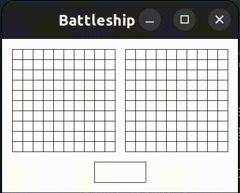

# XTemplate

My X11 learning project featuring C++ as DSL for vidgets via templates.

## Demo



## Requirements

```bash
sudo apt install libx11-dev
```

## Build

```bash
make
```

## Run

```bash
make run
```
